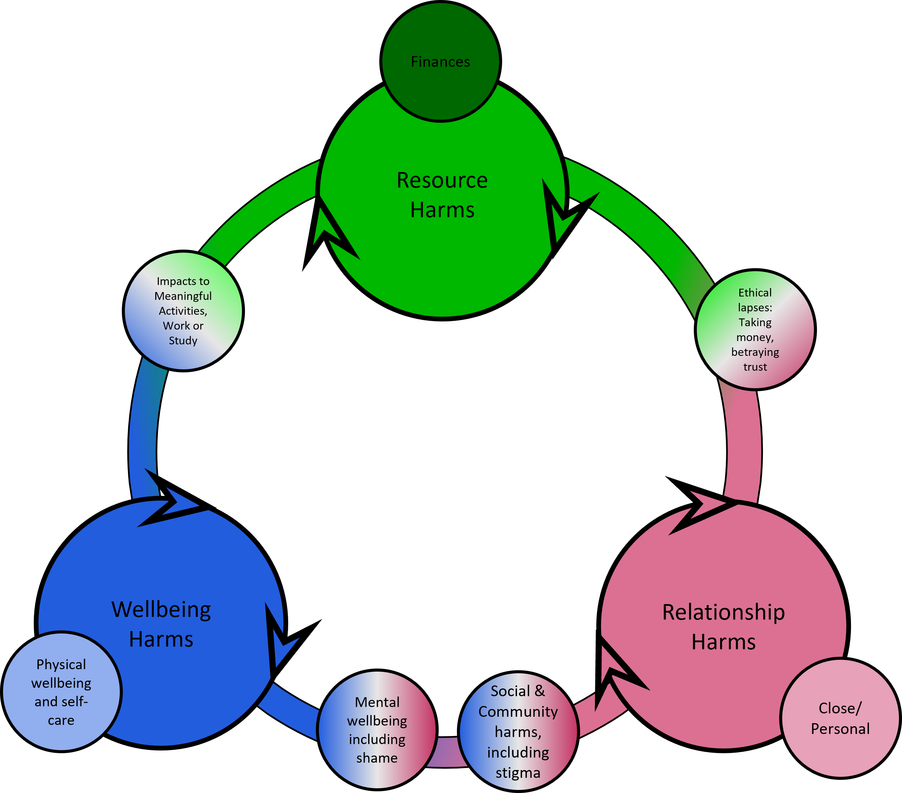

```{r setup, include=FALSE}
knitr::opts_chunk$set(echo = FALSE)

# Learn more about creating websites with Distill at:
# https://rstudio.github.io/distill/website.html

# Learn more about publishing to GitHub Pages at:
# https://rstudio.github.io/distill/publish_website.html#github-pages

```

Gambling harm isn’t just about losing money. It can affect people’s wellbeing, relationships, and everyday functioning—and these harms are often deeply connected. To truly understand gambling harm, we need to look beyond isolated symptoms and consider how harms build, overlap, and shift over time – including the reduction or recovery from these harms. 


That’s the purpose of the GHSI’s holistic frameworks.

## Seeing the full picture of harm - and recovery

At the heart of the Gambling Harms Scale Initiative is a framework that maps the wide range of ways gambling can impact people. This model was jointly developed from rich, in-depth interviews with people who had lived experience of gambling harm—whether through their own gambling or that of someone close to them and from an existing body of literature. The framework was influenced by Wardle *et al*.'s [Framework for Action](https://eprints.lse.ac.uk/89248/1/McDaid_Gambling-Related_harms_Published.pdf), Langham *et al*.'s [Gambling Harms Framework](https://bmcpublichealth.biomedcentral.com/articles/10.1186/s12889-016-2747-0), and a range of demographically diverse studies. For details of the development process, please see our [publications](papers.html).


The Framework comes in two parts, the first part represents that interconnected network of harm. But the Framework doesn’t just identify harm, it helps us see how people build resilience and recover from gambling harms - this is encapsulated in our Recovery Framework.


Many people move through cycles of harm, stability, and improvement. The Framework recognises that recovery isn't always linear, and that progress can look different for different people. By showing how harms are connected, it also shows how positive change in one area—like mental wellbeing or financial stability—can unlock improvements in others.

# The Frameworks at a Glance


This visual map of gambling harms is organised into three broad components:

-  **Wellbeing Harms** --- including mental and physical wellbeing impacts such as stress, anxiety, depression, and self-neglect.
-  **Resource Harms** --- such as financial strain, impacts to important activities like work or study, and instances of ethical lapses.
-  **Relationship Harms** --- including “loss of presence” in family life and relationship tensions, breakdown or disconnection across personal, social, and community relationships.

Each area is interconnected. The diagram shows how harms flow, overlap, and compound. 


-  **From Harms to Capital.** This change represents the resilience building at the heart of recovery. Recovery is focused on rebuilding from previous experience of harm. 
-  **More than abstinence.** Our lived experience and service provider experts helped us steer the Framework towards a more nuanced definition of recovery that works for as many people as possible. 
-  **At the center of the framework is recovery.** This represents the personal journey of moving out of harm, including regaining **control** over gambling and life decisions, developing **insight** into what led to harm, taking **ownership** of the steps forward, and making meaningful **behaviour change**. 


## Why this framework matters

-  **It centres lived experience** The model reflects how people *actually* experience harm and recovery, in their own words.
-  **It informs better support.** From frontline services to national policy, this approach helps professionals recognise and respond to the full impact of gambling — and the pathways out of it.
-  **It supports meaningful measurement.** This framework underpins the [Gambling Harms Severity Index](GHSI_tools.html), which allows people and services to track harm and recovery over time
